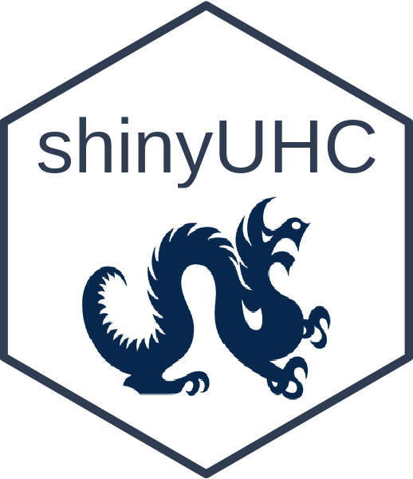

<!-- README.md is generated from README.Rmd. Please edit that file -->

# shinyUHC 

An R package which allows you to initialize UHC or SALURBAL theme shiny
apps.

## Installation

To install the dev version from GitHub:

``` r
library(devtools)
install_github("Drexel-UHC/shinyUHC")
```

## Getting Started

Once install, load the library and initiate a shiny app.

``` r
library(shinyUHC)
## Initialize a UHC themed Shiny app
initializeShinyApp(dest = "./app", theme ="UHC")
## Initialize a SALURBAL themed Shiny app
initializeShinyApp(dest = "./app", theme ="SALURBAL")
```

Your theme shiny app template can be found in the destination folder you
set. For help or bug report please submit issues onto this repository!
Happy coding 🍰!!
